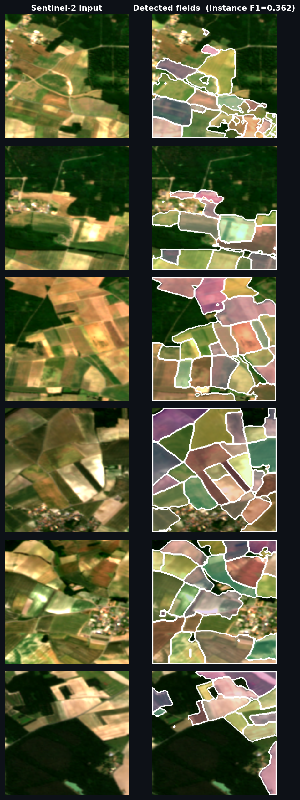
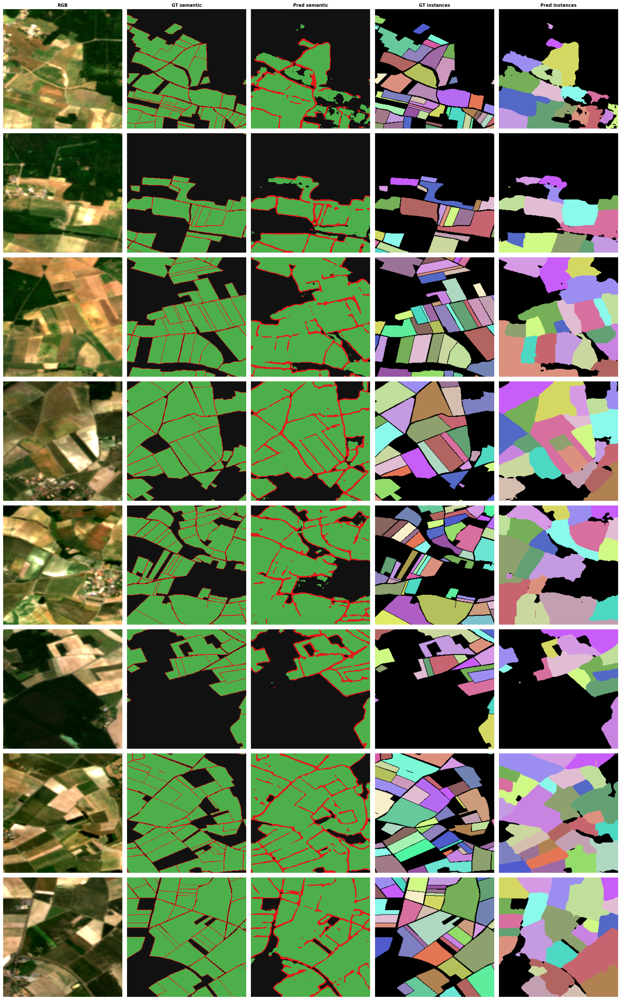
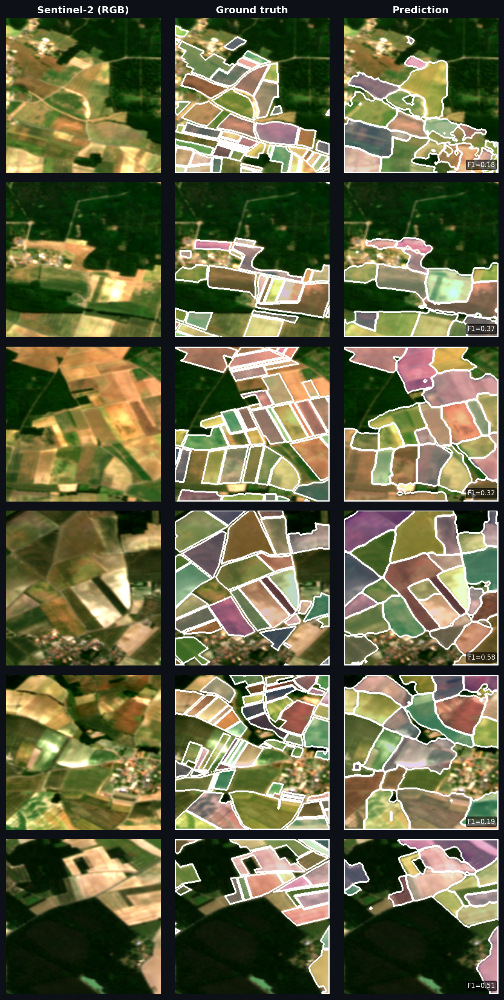

# Field Detection

Semantic segmentation of agricultural fields from Sentinel-2 satellite imagery. Given a multi-spectral image chip, the model detects and delineates individual field parcels.



## What it does

The pipeline takes a 256×256 Sentinel-2 chip (two seasonal acquisitions, 8 bands each) and produces a labeled instance map where each detected field has a unique ID. The main steps are:

1. **Segmentation** — a UNet (EfficientNet-B0 encoder) classifies each pixel as background, field interior, or field border
2. **Instance extraction** — a watershed algorithm separates touching fields using the predicted interior mask

## Dataset

Uses the [Fields of the World (FTW)](https://fieldsofthe.world/) dataset. Seven countries are included in training: France, Netherlands, Spain, Belgium, Estonia, Latvia, Lithuania.

Data is not included in this repository. See the FTW website for download instructions. Expected layout:

```
data/ftw/
└── <country>/
    ├── chips_<country>.parquet
    ├── s2_images/
    │   ├── window_a/<aoi_id>.tif   # 4 S2 bands, first time window
    │   └── window_b/<aoi_id>.tif   # 4 S2 bands, second time window
    └── label_masks/
        ├── semantic_3class/<aoi_id>.tif
        └── instance/<aoi_id>.tif
```

## Model

- **Architecture**: UNet with EfficientNet-B0 encoder (pretrained on ImageNet), ~6.3M parameters
- **Input**: 13 channels — 8 raw Sentinel-2 bands (R, G, B, NIR × 2 windows) + 5 spectral indices (NDVI×2, ΔNDVI, EVI×2)
- **Output**: 3-class pixel mask (background / interior / border)
- **Loss**: 0.5 × weighted cross-entropy + 0.5 × Lovász loss
- **Post-processing**: distance transform + watershed on predicted interior mask

Designed to run on a laptop (tested on MacBook Air M2, 8 GB). One training run takes approximately 6–12 hours.

## Results

| Metric | Value |
|---|---|
| mIoU | 0.506 |
| Interior IoU | 0.709 |
| Border IoU | 0.172 |
| Instance F1@0.5 | 0.362 |

*Evaluated on the France test split (396 chips). Training ran for 30 epochs on 7 countries (~24 500 chips), ~12 hours on a MacBook Air M2 8 GB.*

## Setup

```bash
python3 -m venv .venv
source .venv/bin/activate
pip install -r requirements.txt
```

## Usage

**Train:**
```bash
python3 src/train.py
```

Training configuration is in [`src/config.py`](src/config.py). Checkpoints are saved to `checkpoints/best.pt` based on the best validation score.

**Evaluate:**
```bash
python3 src/evaluate.py
```

Prints mIoU and Instance F1@0.5 on the France test split. Saves three image files to `outputs/`:

| File | Content |
|---|---|
| `eval_samples.png` | 5-column debug grid: RGB / GT semantic / pred semantic / GT instances / pred instances |
| `readme_overlay.png` | Input RGB alongside predicted fields (colored) + boundaries (white lines) |
| `readme_overview.png` | Side-by-side: RGB / ground truth overlay / prediction overlay |

## Evaluation visuals

### 5-column debug grid



### Ground truth vs prediction


